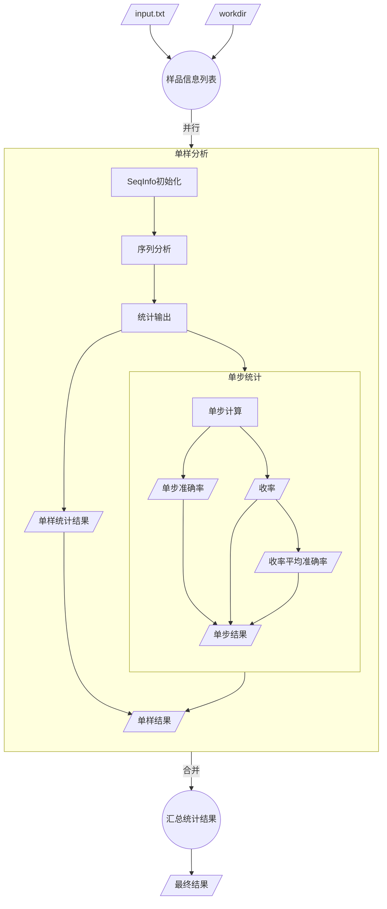

```mermaid
flowchart TB

subgraph User[用户]
    Input[/input.txt文件/]
    Workdir[/工作路径/]
    Result[/分析结果/]
end

subgraph Web_Brosser[网页浏览器]
    direction LR
    Page1[/网页1/]
    Page2[/网页2/]
end


subgraph Web_Server[Web服务]
    direction LR
    Router[路由]

    subgraph uploadHandler[处理函数]
        direction TB
        input[/input.txt/]
        workdir[/workDir/]
        outputDir[/outputDir/]
        result[/分析结果/]

        subgraph CLI_Program["CLI程序"]
        end

        input     --> |-i| CLI_Program
        workdir   --> |-w| CLI_Program
        outputDir --> |-o| CLI_Program

        CLI_Program -->result
    end
end

Input    --> |上传| Page1
Workdir  --> |填入| Page1

Page1         --> |POST| Router
Router        --> |input.txt,workDir|uploadHandler
uploadHandler --> |GET|Page2
Page2         --> |下载链接|Result ->

style CLI_Program fill:#f9f
```


